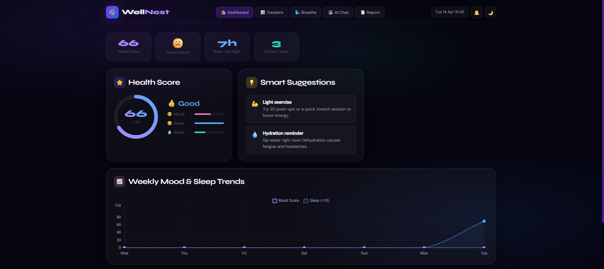
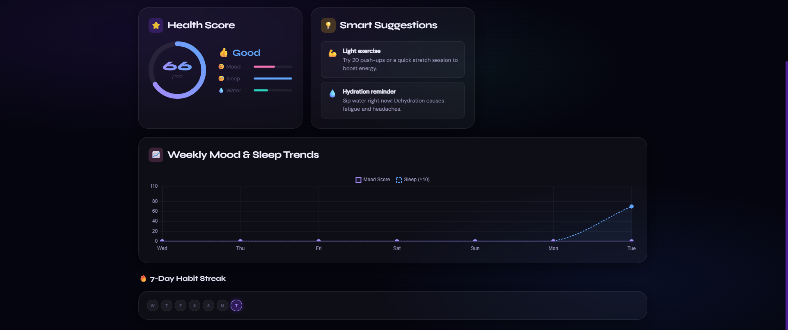
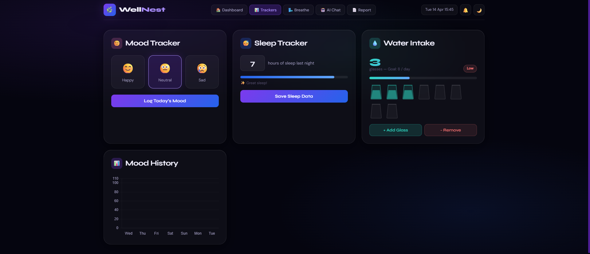
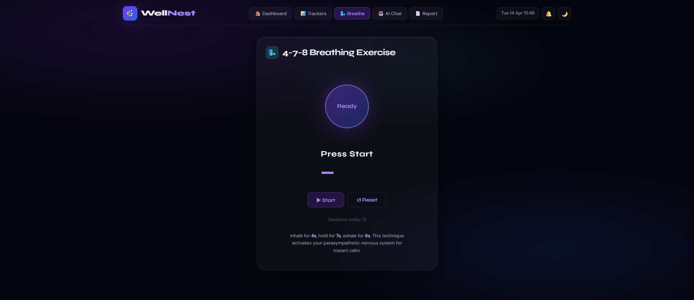
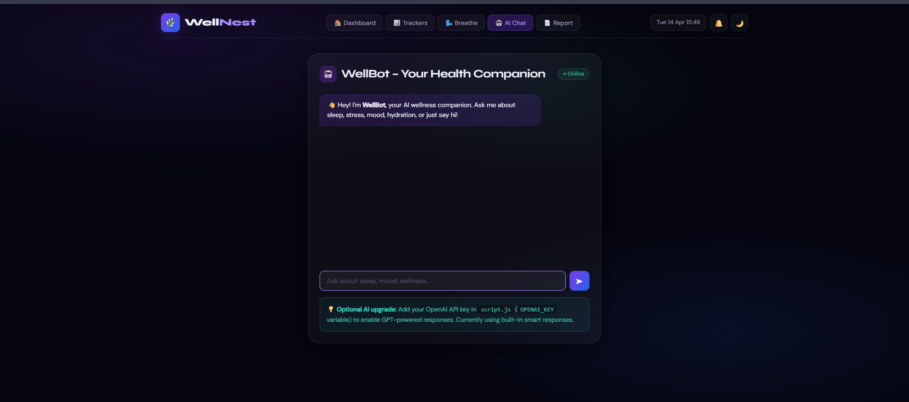
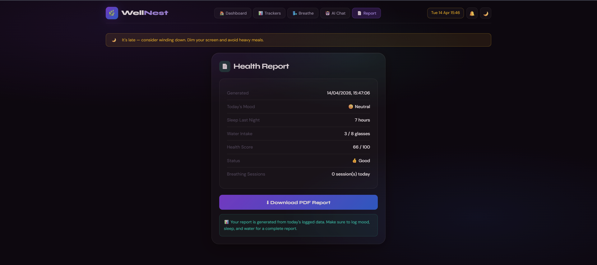
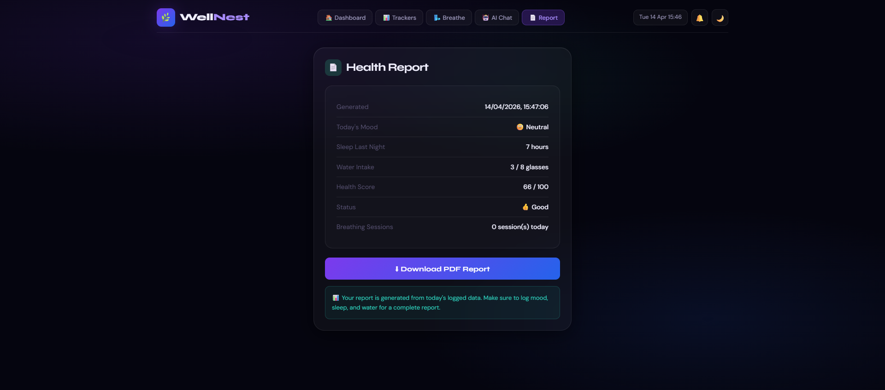

# 🌿 WellNest – Smart Student Health Companion

A modern web-based wellness dashboard designed to help students track and improve their **mental and physical health habits** in one place.

---

## 🚀 Live Demo

🔗 https://anshita14garg-blip.github.io/WellNest/

---

## 🎥 Demo Video

🔗 https://youtu.be/Zjrs3eIxXpI

---

## ✨ Features

* 📊 Dashboard with real-time health score
* 😊 Mood tracking
* 😴 Sleep tracking
* 💧 Water intake monitoring
* 🌬️ 4-7-8 breathing exercise
* 🤖 AI wellness chatbot (WellBot)
* 📄 Downloadable health report
* 🔔 Smart alerts & habit tracking
* 📈 Weekly analytics with charts

---

## 🧠 Tech Stack

* HTML
* CSS
* JavaScript
* Chart.js
* jsPDF
* LocalStorage

---

## ⚙️ How to Use

No setup required.

Just open the live demo and start using it 🚀

---

## 📸 Screenshots

🧑‍💻 Editor

### 📊 Dashboard

### 📈 Trackers

### 🌬️ Breathing

### 🤖 AI Chat

### 🔔 Notifications / Theme

### 📄 Report

---

## 🎯 Goal

Aligned with **UN SDG 3: Good Health & Well-being**

---

## 👩‍💻 Author

**Anshita Garg**

---

## ⭐ Support

Give a ⭐ if you like this project!
